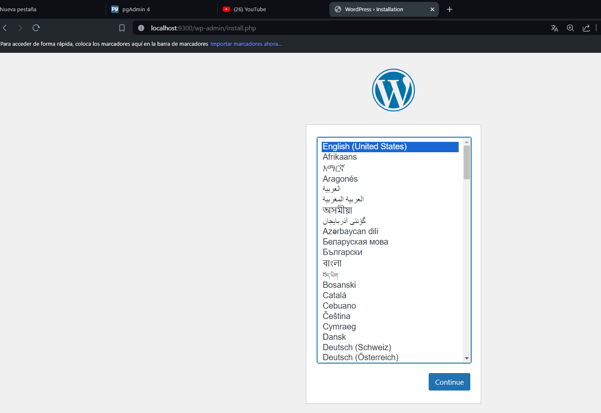
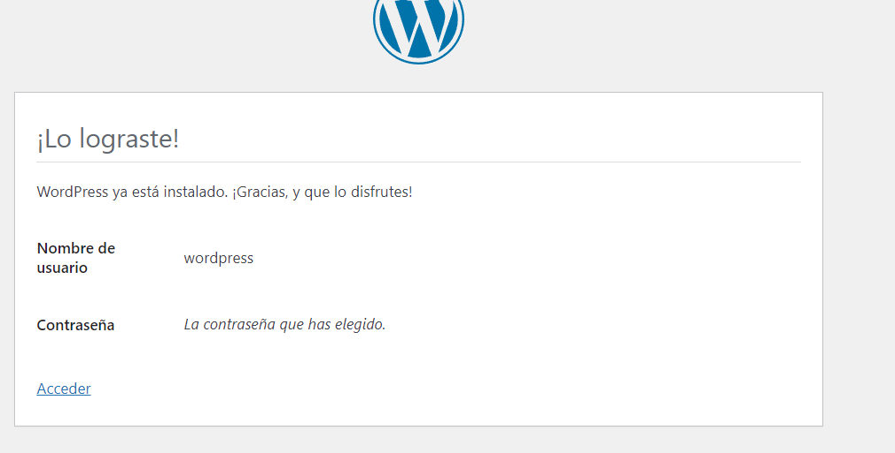
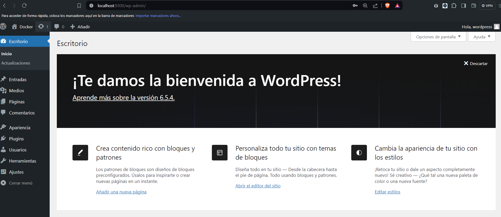
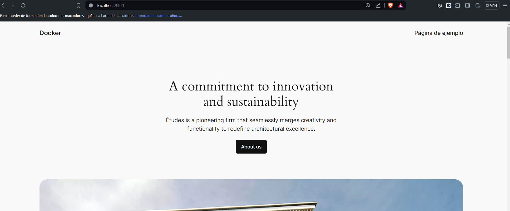

## Esquema para el ejercicio

### Crear la red net-wp

docker network create net-wp

# COMPLETAR

### Crear el contenedor de nombre mysql a partir de la imagen mysql:8, configurar las variables de entorno necesarias

docker run -d --name mysql --network net-wp -e MYSQL_ROOT_PASSWORD=my-secret-pw -e MYSQL_DATABASE=wordpress mysql:8

# COMPLETAR

### Crear el contenedor wordpress a partir de la imagen: wordpress, configurar las variables de entorno necesarias

docker run -d --name wordpress --network net-wp -p 9300:80 -e WORDPRESS_DB_HOST=mysql -e WORDPRESS_DB_NAME=wordpress -e WORDPRESS_DB_USER=root -e WORDPRESS_DB_PASSWORD=my-secret-pw wordpress

# COMPLETAR

De acuerdo con el trabajo realizado, en la el esquema de ejercicio el puerto a es **9030**

Ingresar desde el navegador al wordpress y finalizar la configuración de instalación.

# COLOCAR UNA CAPTURA DE LA CONFIGURACIÓN

Desde el panel de admin: cambiar el tema y crear una nueva publicación.
Ingresar a: http://localhost:9300/ 
recordar que a es el puerto que usó para el mapeo con wordpress
# COLOCAR UNA CAPTURA DEL SITO EN DONDE SEA VISIBLE LA PUBLICACIÓN.

### Eliminar el contenedor wordpress

docker rm -f wordpress

# COMPLETAR

### Crear nuevamente el contenedor wordpress
Ingresar a: http://localhost:9300/ 
recordar que a es el puerto que usó para el mapeo con wordpress

### ¿Qué ha sucedido, qué puede observar?

Sale una página de ejemplo
# COMPLETAR

