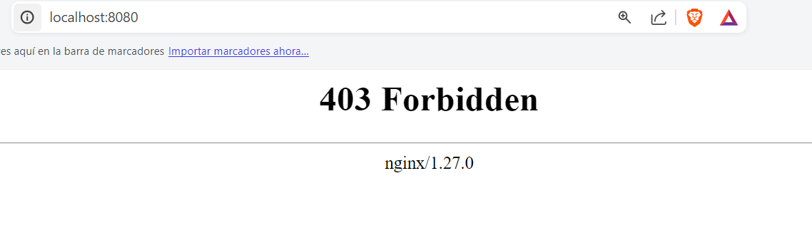

# VOLUMEN TIPO HOST
Un volumen host (o bind mount) es un tipo de volumen donde se monta un directorio o archivo específico del sistema de archivos del host en un contenedor.

```
docker run -d --name <nombre contenedor> -v <ruta carpeta host>:<ruta carpeta contenedor> <imagen> 
```

### Crear un volumen tipo host con la imagen nginx:alpine, para la ruta carpeta host: directorio en donde se encuentra la carpeta html en tu computador y para la ruta carpeta contenedor: /usr/share/nginx/html esta ruta se obtiene al revisar la se obtiene desde la documentación

# COMPLETAR CON EL COMANDO

docker run -d --name srv-vol -p  8080:80 -v C:\Users\enriq\OneDrive\Documentos\html:/usr/share/nginx/html nginx:alpine

### ¿Qué sucede al ingresar al servidor de nginx?

Aparece un mensaje con el código 403 de página no encontrada


# COMPLETAR CON LA RESPUESTA A LA PREGUNTA

### ¿Qué pasa con el archivo index.html del contenedor?

No hay nada en el directoriol donde debería estar el archivo html

# COMPLETAR CON LA RESPUESTA A LA PREGUNTA

### Ir a https://html5up.net/ y descargar un template gratuito, descomprirlo dentro de nginx/html
### ¿Qué sucede al ingresar al servidor de nginx?

Aparece la página de la plantilla descargada
# COMPLETAR CON LA RESPUESTA A LA PREGUNTA

### Eliminar el contenedor

docker rm srv-vol
# COMPLETAR CON EL COMANDO

### ¿Qué sucede al crear nuevamente el mismo contenedor con volumen de tipo host a los directorios definidos anteriormente?
# COMPLETAR CON LA RESPUESTA A LA PREGUNTA
Sigue apareciendo la página de la plantilla descargada
### ¿Qué hace el comando pwd?
# COMPLETAR CON LA RESPUESTA A LA PREGUNTA
Si quieres incluir el comando pwd dentro de un comando de Docker, lo puedes hacer de diferentes maneras dependiendo del shell que estés utilizando.


### Volumen tipo host usando PWD y PowerShell
```
docker run -d --name <nombre contenedor> --publish published=<valorPuertoHost>,target=<valor> -v ${PWD}/<ruta relativa>:<ruta absoluta> <nombre imagen>:<tag> 
```

### Volumen tipo host usando PWD (Git Bash)

```
docker run -d --name <nombre contenedor> --publish published=<valorPuertoHost>,target=<valor> -v $(pwd -W)/html:/usr/share/nginx/html <nombre imagen>:<tag> 
```

### Volumen tipo host usando PWD (en Linux)

```
docker run -d --name <nombre contenedor> --publish published=<valorPuertoHost>,target=<valor> -v $(pwd)/html:/usr/share/nginx/html <nombre imagen>:<tag> 
```

