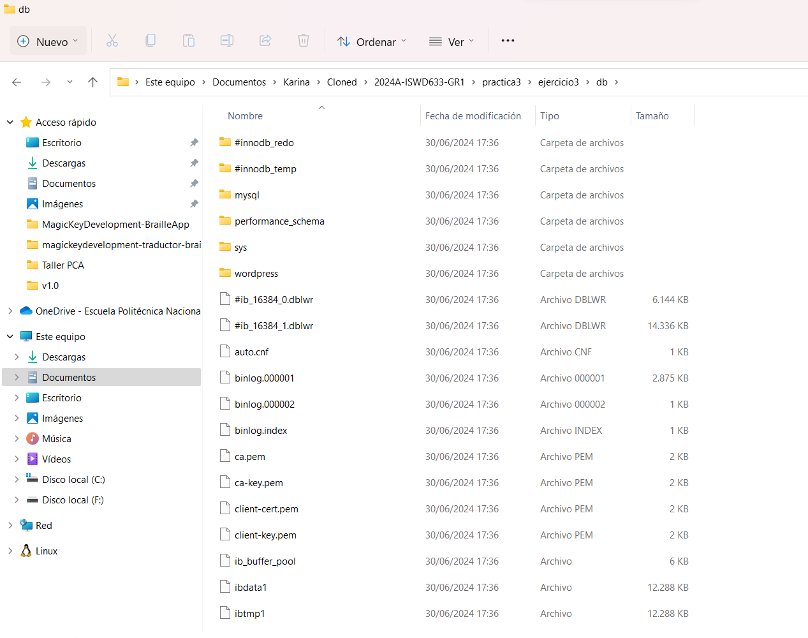
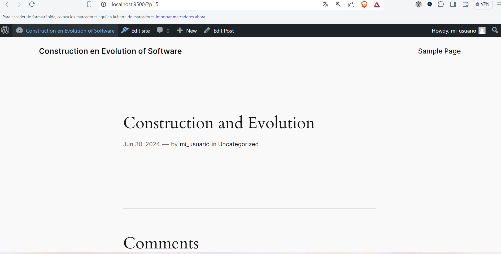
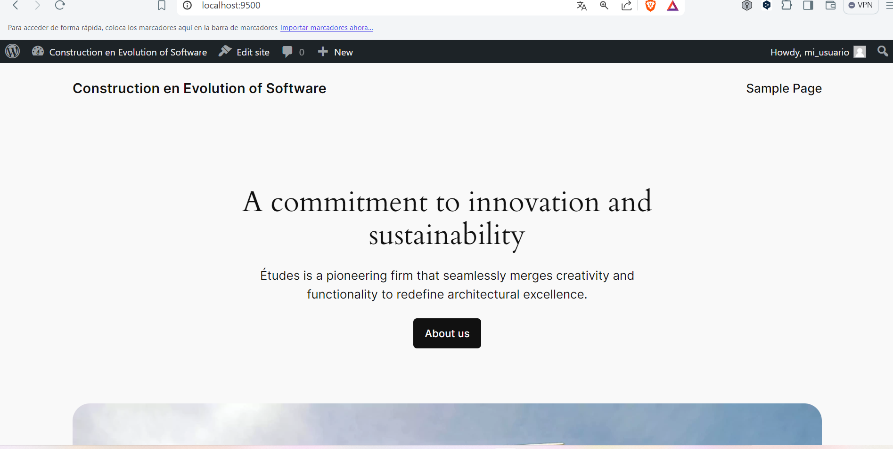

## Esquema para el ejercicio

### Crear red net-wp

docker network create net-wp
# COMPLETAR CON EL COMANDO COMANDO

### Para que persista la información es necesario conocer en dónde mysql almacena la información.
# COMPLETAR LA SIGUIENTE ORACIÓN. REVISAR LA DOCUMENTACIÓN DE LA IMAGEN EN https://hub.docker.com/)
En el esquema del ejercicio la carpeta contenedor (a) es /var/lib/mysql

Ruta carpeta host: .../ejercicio3/db

### ¿Qué contiene la carpeta db del host?
Los archivos de la base de datos MySQL
# COMPLETAR CON LA RESPUESTA A LA PREGUNTA

### Crear un contenedor con la imagen mysql:8  en la red net-wp, configurar las variables de entorno: MYSQL_ROOT_PASSWORD, MYSQL_DATABASE, MYSQL_USER y MYSQL_PASSWORD

docker run -d --name mysql --network net-wp -v C:\Users\enriq\OneDrive\Documentos\Karina\Cloned\2024A-ISWD633-GR1\practica3\ejercicio3\db:/var/lib/mysql -e MYSQL_ROOT_PASSWORD=mi_password_secreto -e MYSQL_DATABASE=wordpress -e MYSQL_USER=mi_usuario -e MYSQL_PASSWORD=mi_password mysql:8

# COMPLETAR CON EL COMANDO

### ¿Qué observa en la carpeta db que se encontraba inicialmente vacía?

Los archivos de la base de datos en mysql con los archivos de configuración

# COMPLETAR CON LA RESPUESTA A LA PREGUNTA

### Para que persista la información es necesario conocer en dónde wordpress almacena la información.
# COMPLETAR LA SIGUIENTE ORACIÓN. REVISAR LA DOCUMENTACIÓN DE LA IMAGEN EN https://hub.docker.com/)
En el esquema del ejercicio la carpeta contenedor (b) es **/var/www/html**
Ruta carpeta host: .../ejercicio3/www

### Crear un contenedor con la imagen wordpress en la red net-wp, configurar las variables de entorno WORDPRESS_DB_HOST, WORDPRESS_DB_USER, WORDPRESS_DB_PASSWORD y WORDPRESS_DB_NAME (los valores de estas variables corresponden a los del contenedor creado previamente)

docker run -d --name wordpress --network net-wp -p 9500:80 -v C:\Users\enriq\OneDrive\Documentos\Karina\Cloned\2024A-ISWD633-GR1\practica3\ejercicio3\www:/var/www/html -e WORDPRESS_DB_HOST=mysql -e WORDPRESS_DB_USER=mi_usuario -e WORDPRESS_DB_PASSWORD=mi_password -e WORDPRESS_DB_NAME=wordpress wordpress
# COMPLETAR CON EL COMANDO

### Personalizar la apariencia de wordpress y agregar una entrada

### Eliminar el contenedor y crearlo nuevamente, ¿qué ha sucedido?

Vuelve a aparecer la página de inicio
# COMPLETAR CON LA RESPUESTA A LA PREGUNTA

